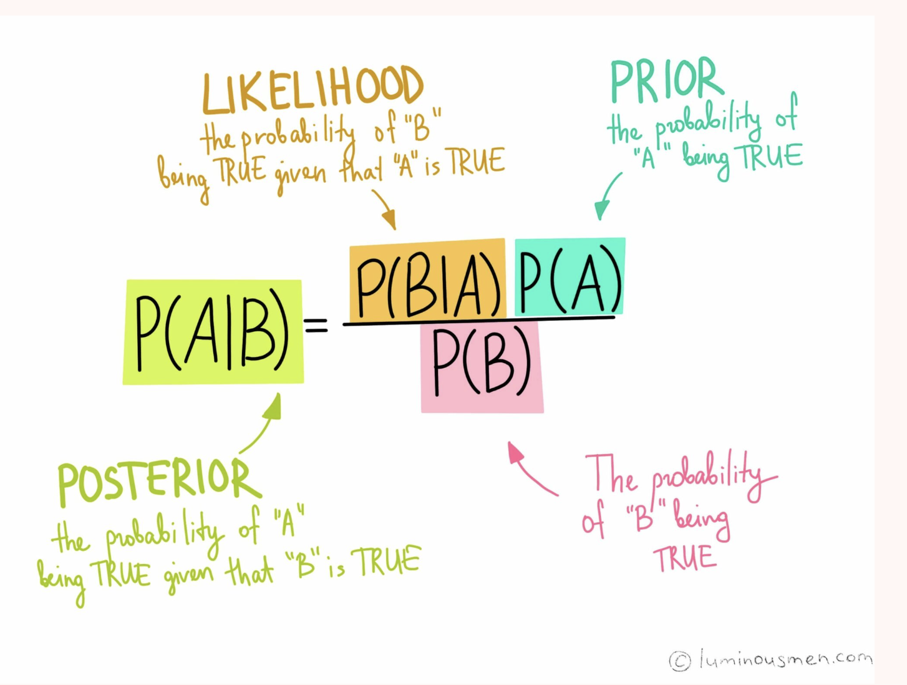

# Naive Bayes classifier

Bayes classification is statistics based learning scheme.

## Advantages

- small memory footprint
- fast training, fast learning
- simplicity

## Assumptions

- features are independent and equally important reason for calling it naive
- works for linear classification problems
- works for non-linear classification problems with kernel trick

[Article](https://sebastianraschka.com/Articles/2014_naive_bayes_1.html)

## Conditional Independence

$P(y| x_1, x_2, ... x_n) = \frac {p(x_1|y)p(x_2|y)... p(x_n|y)p(y)}{p(x_1)p(x_2)... p(x_n)}$

As denominator is constant for all values:

$P(y| x_1, x_2, ... x_n) \propto p(x_1|y)p(x_2|y)... p(x_n|y)p(y)$  
$P(y| x_1, x_2, ... x_n) \propto P(y) \displaystyle \prod ^n _{i=1} P(x_i|y)$

## Maximum a Posteriori (MAP)

$y = argmax_y P(y) \displaystyle \prod ^n _{i=1} P(x_i|y)$

## Bayes Theorem

$P(A|B) = \frac {p(B|A)  p(A)}{p(B)}$

If we are given feature vector $X = (x1, x2, ... xn) $ and a class variable $C_k$, then bayes theorem for it:
$P(C_k| X) = \frac {p(X|C_k) p(C_k)}{p(X)}$

if we break likelihood by chain rule:
$P(X| C_k) = p(x_1, x_2, ... x_n|C_k) = p(x_1| x_2, x_3,... x_n, C_k)p(x_2 | x_3,.. x_n, C_k).. p(x_{n_1}| x_n, C_k)p(x_n|C_k)$

[Basic Explanation](https://fritz.ai/understanding-the-mathematics-behind-naive-bayes/)
[Good Example](https://sebastianraschka.com/Articles/2014_naive_bayes_1.html)

## Define Generative Model

Applying chain rule to joint distribution:
$p(x,y | \theta, \pi) = p(y | \pi)\enspace . \enspace p(x| y, \theta)$

where $\theta$ is parameters of the model and $\pi$ denotes the parameters defining the probability distribution over the possible output labels y.
The parameter vector $\pi$ can be interpreted as “carved out” of the parameter vector $\theta$. In other words, y depends on $\pi$, while input x does not.
The probability $p(y | \pi)$ gives the probability that y is equal to some class c.
It is the marginal distribution of outputs y parameterised by $\pi$, which is also called class prior. The parameter vector $\pi$ is made up of a set of parameters, one for each class. For a class c, the parameter $\pi_c$ is the probability that: $p(y=c | \pi) =  \pi_c$.

Overall, for a generative model, we need to **estimate the parameters $\pi_c, \theta_c$ for every class $c \in {1, . . . , C }$**.

Once we get the parameters and these marginal distributions and class-conditional distributions, we can then plug them into Equation.

## Predicting using Generative Classification Models

Given a feature vector $X = (x_1, x_2, ... x_n) $ and a class variable $C_k$, then bayes theorem for it:
$P(C_k| X) = \frac {p(X|C_k) p(C_k)}{p(X)}$

Consider a classification problem, assume we have trained the generative model p(x,y | θ). For a new input $x_{new}$, we compute for every possible category/class $c \in {1, . . . , C}$ a conditional distribution:

$p(y=c|X_{new}, \theta) = \frac {p(X_{new}, \enspace y = c | \theta)}{p(X_{new}| \theta)} =
\frac {p(y = c | \theta) \enspace. \enspace p(X_{new} | y = c, \theta)}{\sum^C_{c` = 1}p(y = c` | \theta) \enspace. \enspace p(X_{new} | y = c`, \theta)}$

The numerator comes from the joint probability distribution $p(x_{new},y = c | \theta)$, which is factorised using the chain rule (of probability). </break>
The denominator comes from the marginal distribution $p(x_{new} | θ)$. We transform $p(x_{new} | θ)$ to the denominator form using the total probability law.

## Types of Naive Bayes

- Gaussian Naive Bayes: feature follow normal distribution
- Multinomial Naive Bayes: used for discrete counts. Can be thought as number of times outcome number $x_i$ is observed under n trials.
- Bernoulli Naive Bayes: used when features are binary
- ComplementNB: Complement Naive Bayes (CNB) algorithm. CNB is an adaptation of the standard Multinomial Naive Bayes (MNB) algorithm that is particularly suited for imbalanced data sets wherein the algorithm uses statistics from the complement of each class to compute the model’s weight.

## Data preparing for Naive Bayes

- Categorical features: convert to one hot encoding, use multinomial distribution
- Numerical features: convert to normal distribution
- Log probabilities: The calculation of the likelihood of different class values involves multiplying a lot of small probabilities together, which can result in an underflow of values, or computationally very low values.
As such, it’s good practice to use a log transform of the probabilities to avoid this underflow.
- Kernel Functions: Instead of assuming a Gaussian distribution for numerical input values, which usually fits all kinds of numerical values, complex distributions can be used.
- Gaussian Inputs: If the input variables are real-valued, a Gaussian distribution is assumed. In this case, the algorithm will perform better if the univariate distributions of your data are Gaussian or near-Gaussian. This may require removing outliers.
[Basic Explanation](https://fritz.ai/understanding-the-mathematics-behind-naive-bayes/)

## Naive Bayes Classifier

The assumption of conditionally independent features enables us to rewrite the class- conditional distribution as the product of the probability of every single feature $x_{ij}$ given the parameter for the class and the feature vector $\theta_{jc}$.
Every feature will get its own set of parameters $θ_{jc}$, which makes the modelling of data easier: We can define a model locally for every single feature, which means we can describe it with a univariate model instead of modelling all features together with a multivariate model.
This reformulation allows us to model different features differently, i.e., we can “mix and match” different distributions for different features.

By plugging this form into the joint probability distribution for the generative models, we get:

$p(x_i, y_i | \theta, \pi) = p(y_i | \pi) \enspace . \enspace p(x_i | y_i, \theta) =
\prod_{c=1}^C \pi_c^{||(y_i = c)} . \prod_{c=1}^C \prod_{j=1}^D p(x_{ij} | \theta_{jc})^{||(y_i = c)}$

[Categorical Naive Bayes Implementation - Good] (https://sidsite.com/posts/implementing-naive-bayes-in-python/)

## Limitation of Naive Bayes

- If a categorical variable has a category in the test dataset, which was not observed in training dataset, then the model will assign a 0 (zero) probability and will be unable to make a prediction. This is often known as Zero Frequency. To solve this, we can use a smoothing technique.

## Additive Smoothing

The most common variants of additive smoothing are the so-called Lidstone smoothing (α<1) and Laplace smoothing (α=1).

$P(x_i|y) = \frac {count(x_i, y) + \alpha}{count(y) + \alpha n_i}$

where $n_i$ is number of possible values of $x_i$ or dimension of $x_i$.

## Gaussian Discriminant Analysis

Gaussian Discriminant Analysis (GDA) is a generative learning algorithm that assumes that the features are distributed according to a Gaussian distribution.
In the Gaussian discriminant analysis, we model the class-conditional distribution for class $c \in {1, . . . , C }$ as a multivariate normal distribution with mean $\mu_c$ and covariance matrix $\sum_c$:
 
$p(x | y = c, \theta_c) = \Nu (x | \mu_c, \sum_c)$

For each class c, we allow for a different multivariate distribution with its own parameters, hence, we have the subscript c for the parameters $\mu_c$ and $\sum_c$.
Unlike the NBC, we now allow for correlations between the features, so we have a covariance matrix $\sum_c$.

The Gaussian discriminant analysis model does not have the ‘naïve’ assumption from NBC, so it performs better in some cases. Imagine, for instance, that we want to predict whether an animal is a zebra or a giraffe based on the animal’s height and weight.
The two measures might be pairwise correlated, so we should not consider the height and weight to be independent, given that we talk about a zebra or a giraffe.

## Quadratic Discriminant Analysis

Quadratic discriminant analysis (QDA) is a case of Gaussian discriminant analysis where we do not have any assumptions about the covariance matrix $\sum_c$.

## Things to implement

[NB for text classification](https://philippmuens.com/naive-bayes-from-scratch)
