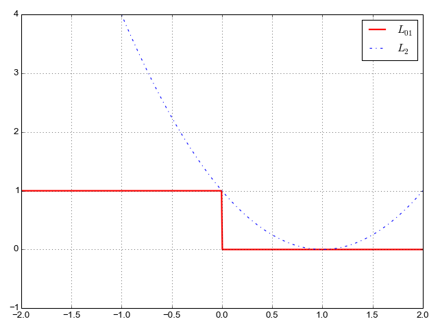

# Logistic Regression

Logistic regression is one of the most popular ways to fit models for categorical data, especially for binary response data. It is the most important (and probably most used) member of a class of models called generalized linear models.
Unlike linear regression, logistic regression can directly predict probabilities (values that are restricted to the (0,1) interval); furthermore, those probabilities are well-calibrated when compared to the probabilities predicted by some other classifiers, such as Naive Bayes.
Logistic regression preserves the marginal probabilities of the training data.
The coefficients of the model also provide some hint of the relative importance of each input variable.
[Derivative Logistic Regression](https://win-vector.com/2011/09/14/the-simpler-derivation-of-logistic-regression/)

The **logistic regression model assumes that the log-odds of an observation y can be expressed as a linear function of the K input variables** x:

$ \log \frac {P(x)}{ 1 - P(x)} =  \Sigma_{j=0}^k b_j \sdot x_j$

The left hand side of the above equation is called the logit of P (hence, the name logistic regression). This eqn is derived to find linear regression to find probability for classification. We need some function which has bounded output and input changes should multiply the probability with fixed output.
The easiest modification of log p which has an unbounded range is the logistic (or logit) transformation.

The distance calculated from decision boundary is :  
$ \frac{b}{||\overrightarrow{w}||} + \overrightarrow{x} \sdot \frac{\overrightarrow{w}}{||\overrightarrow{w}||} $  
Class probability depends on the distance from the decision boundary. [LR](https://www.stat.cmu.edu/~cshalizi/350/lectures/26/lecture-26.pdf)

If we take exponents on both side:

$ \frac {P(x)}{ 1 - P(x)} = \exp (\Sigma_{j=0}^k b_j \sdot x_j) $

$ = \Pi_{j=0}^k \exp(b_j \sdot x_j) $

This eqn shows that logistic models are multiplicative in their input unlike additive of linear model.
The value exp(bj) tells us how the odds of the response being “true” increase (or decrease) as xj increases by one unit, all other things being equal.
For example, suppose bj = 0.693. Then exp(bj) = 2. If xj is a numerical variable (say, age in years), then every year’s increase in age doubles the odds of the response being true — all other things being equal.
If xj is a binary variable (say, sex, with female coded as 1 and male as 0), then if the subject is female, then the response is two times more likely to be true than if the subject is male, all other things being equal.

log likelihood of predicted probabilities of the N individual observations:

$ \text{Log likehood} (X|P) = \sum_{i=1, y_i =1}^N log P(x_i) + \sum_{i=0, y_i =0}^N log (1 - P(x_i)) $

Maximizing the log-likelihood will maximize the likelihood.
As a side note, the $\text{quantity} − 2 \ast \text{log-likelihood}$ is called the **deviance of the model**.
It is analogous to the residual sum of squares (RSS) of a linear model. Ordinary least squares minimizes RSS; **logistic regression minimizes deviance**.
A useful goodness-of-fit heuristic for a logistic regression model is to compare the deviance of the model with the so-called **null deviance**: the deviance of the constant model that returns only the global response probability for every data point.
One minus the ratio of deviance to null deviance is sometimes called pseudo-R2, and is used the way one would use R2 to evaluate a linear model.

$\text{psuedo-R}^2 = 1 - \frac{\text{deviance}}{\text{null deviance}}$

According to the eqn,

$ \Sigma_{i=1}^N y_i \sdot x_i - P_i \sdot x_i = 0 $

which we got after taking gradient of log likelihood function and solving the equation.
Notice that the equations to be solved are in terms of the probabilities P (which are a function of b), not directly in terms of the coefficients b themselves. This means that logistic models are coordinate-free: for a given set of input variables,
the probabilities returned by the model will be the same even if the variables are shifted, combined, or rescaled. Only the values of the coefficients will change.

Question - What is meant by given statement that logistic regression preserves the marginal probabilities of the training data.  
Answer - The other thing to notice from the above equations is that the sum of probability mass across each coordinate of the $x_i$ vectors is equal to the count of observations with that coordinate value for which the response was true.  
$\Sigma_{i=1, x_{ij}=1}^N y_i = \Sigma_{i=1, x_{ij}=1}^N P_i$  
Sum of all the probability mass over the entire training set will equal the number of “true” responses in the training set.

## Solving for the Coefficient Using Newton's Method

Applying [Newtons Method](./../optimisation/second_order.md) to solve for optimum value of b. In the case of logistic regression, we are trying to find the values of b that make the gradient of the log-likelihood function equal to zero.
In this case, function to be minimized is the negative of the log-likelihood function, so finding the values of b that make the gradient of the negative log-likelihood function equal to zero requires double differentiation of the log-likelihood function.
This introduce hessian matrix which is equivalent to $H = XWX^T$ and $W = P_i(1-P_i)$.  
For each iteration, the $\varDelta$ is updated by:  
$\varDelta_k = (XWX^T)^{-1}X(y-P_k)$  
where W is the current matrix of derivatives, y is the vector of observed responses, and Pk is the vector of probabilities as calculated by the current estimate of b.
$$
\begin{align*}
y & = X^T \times b \\
Xy & = XX^Tb \\
b & = (X^TX)^{-1} \times X^Ty
\end{align*}
$$

Looking at the two, $\varDelta$ seems similar to solution of weighted least square problem. Here response or output is difference between the observed response and its current estimated probability of being true. Technique of solving logistic regression is called iteratively re-weighted least squares.

As we can see in newton's method we require to calculate inverse of Hessian matrix. This is computationally expensive and if input variables are correlated then Hessian H will be ill-conditioned. This will result in large error bars (or “loss of significance”) around the estimates of certain coefficients.
It can also result in coefficients with excessively large magnitudes, and often the wrong sign. Regularization can also be used to penalized large coefficient and bound them.

## Activation Function

### Drawbacks of Sigmoid and Tangent Activation function for Binary Classification

- Vanishing gradient -- In NN, when the gradient is too small, the weights are not updated. This is a problem for sigmoid and tanh because the gradient is small when the input is large or small.
Gradient of sigmoid has max value of 0.25, for NN with 10 layers, to update first layer weight, the gradient is 0.25^10 = 0.0001, which is too small to update the weight. This is called vanishing gradient problem.

- Sigmoid activation is not zero-centered -- The gradient of sigmoid is always positive, so the gradient descent will always go in the same direction. This is not good for NN because the weights will always be updated in the same direction.
This is called zig-zagging problem when weights needs to be updated in other direction. The tanh activation is zero-centered, it has values in both positive and negative range so the gradient descent can go in both directions.
Having stronger gradients: since data is centered around 0, the derivatives are higher. To see this, calculate the derivative of the tanh function and notice that its range (output values) is [0,1]. [Efficient Backprop - Yann Lecun](https://github.com/rupak-118/AI-papers/blob/master/Efficient%20Backprop%20-%20Yann%20LeCun.pdf)

Tanh which is symmetric sigmoid should have input normalised, more likely to produce result close to average zero. They converge faster than sigmoid.
To avoid flat tops, linear term is added to tanh. Potential problem of symmetric sigmoids is that the error surface can be very flat near the origin. It is good to avoid initializing with very small weights. The error surface is also flat far from the origin, this is due to satuaration of the sigmoids.
Adding small linear terms is a good way to avoid this problem.

### Choosing Target Values

Common wisdom might suggests that the target values be set at the value of the sigmoid's asymptotes.
Drawback of this approaches are: [Efficient Backprop - Yann Lecun](https://github.com/rupak-118/AI-papers/blob/master/Efficient%20Backprop%20-%20Yann%20LeCun.pdf)

- The training process will try to achieve the output as close as possible to the target values, which means the output will be pushed to the asymptotes. As a result, weights are driven to larger and larger values when the sigmoid derivative is closer to zero.
The very large weights increase the gradients, however, the gradients are then multiplied by the very small sigmoid derivative, which results in very small weight updates. As a result weights may become stuck.
- When output saturate, the network give no indication of confidence level. When an input pattern fall near the decision boundary, the output class is uncertain.
These values are not near to any asymptotes. Large weights tend to force all outputs to the tails of sigmoid irrespective of the uncertainity. Thus network can give wrong class without giving any indication of low confidence.

Solution to these problems is to set target value values to be within the range of sigmoids, rather than at asymptotatic value. Setting the target values to the point of maximum second derivative on the sigmoid is the best way to take advantage of non-linearity without satuarating the sigmoid.

## Loss Function

### Binary Cross Entropy

Binary Cross entropy, on the other hand, is a good choice when working with neural networks and when the objective is to predict probabilities.
It is also a good choice when the positive and negative examples are of similar size. Binary Cross Entropy is more numerically stable than Hinge Loss. It is also more computationally expensive than Hinge Loss.

### using tanh as activation function

`
def C(y, a):
    return  -.5 * ( (1-y)*log(1-a) + (1+y)*log(1+a) ) + log(2)
`
[source](https://stats.stackexchange.com/questions/221901/can-the-cross-entropy-cost-function-be-used-with-tanh)

`
tanh(x) = 2sigmoid(2x) - 1
`

Its good for approximating sign function. For tanh activation function, the gradient saturates rapidly at increasingly large absolute values of the
argument. Although, this loss function is nonconvex, we can still apply GD or Newton to minimize
it. [Logistic Regression](https://studentweb.uvic.ca/~leizhao/MLSPnotes/FL/Logistic%20Regression.pdf)

### Why normalise the input

Convergence is faster when the input is normalised. i.e average of each input variable in training set is close to 0. Any shift of average input away from zero will bias the update in given direction and slow down learning.
This heuristics should be applied in all layers of NN which means the average of each output node to be close to 0 because these are input to next layer input. [Efficient Backprop - Yann Lecun](https://github.com/rupak-118/AI-papers/blob/master/Efficient%20Backprop%20-%20Yann%20LeCun.pdf)

When all the components of the input vector is positive, all updates of the weights that feed into a node will have the same sign. As a result, these weights can only move in one direction at a time. All decrease or increase together for a given input pattern.
Thus, if a weight vector is needs to change direction, it will need to do zigzagging which is ineffecient and slow. [Efficient Backprop - Yann Lecun](https://github.com/rupak-118/AI-papers/blob/master/Efficient%20Backprop%20-%20Yann%20LeCun.pdf)

Convergence is faster if inputs are scaled so that all inputs have same covariance. Scaling speeds learning because it helps to balance out the rate at which the weights connected to input nodes learn.
If one input is large and another is small, the weights connected to the large input will learn more slowly than the weights connected to the small input. This is because the error surface will be narrower in the direction of the small input and wider in the direction of the large input.
Scaling the inputs to have the same covariance fixes this problem. **The value of covariance should match sigmoid used**. If sigmoid is used, the covariance should be 1/12. If tanh is used, the covariance should be 1/3. For less significant input variables, the covariance should be smaller.

Input variables should be uncorrelated if possible. PCA is used to remove linear correlation. Inputs which are related produce degenerate directions in the error surface.
This means that the error surface will be flat in certain directions. This makes it difficult for the learning algorithm to find the minimum.
If the inputs are uncorrelated, the error surface will be smooth and bowl-shaped, which makes it easier to find the minimum.
[Efficient Backprop - Yann Lecun](https://github.com/rupak-118/AI-papers/blob/master/Efficient%20Backprop%20-%20Yann%20LeCun.pdf)

### Margin loss

Margin of classifictiona is $ m = y^(x) y $. In this case y is either +1 or -1. Margin is positive if the classification is correct and negative if the classification is incorrect. The margin loss function is defined as $ L = max(0, -m) $.

$L_{01}(m) =  \|(m \leq 0) $

This loss function is not convex. Combinatorial search techniques are required to minimize this loss function. The gradient of the loss function is zero if the margin is positive and undefined otherwise.

This loss function is also called hinge loss. The loss is zero if the margin is positive. If the margin is negative, the loss is proportional to the magnitude of the margin. The loss is convex and differentiable. The gradient of the loss function is $ -y^x $ if the margin is negative and zero otherwise.

### Square loss function

$L_{sq}(m) =  (m-1)^2 $

Square loss as function of margin. At $ m = 1$ loss is zero. Since this is correct classification. Loss at m = 0 to be 1.

<!--  -->

A couple of problems are immediately apparent with the square loss:

- It penalizes correct classification as well, in case the margin is very positive. This is not something we want! Ideally, we want the loss to be 0 starting with m=1 and for all subsequent values of m. If for correct value, we get margin more than 1, then it get added to the loss.
- It very strongly penalizes outliers. One sample that we misclassified badly can shift the training too much.

This problem arise if m doesn't lie in $ \in \brace +1, -1 \rbrace $ ( my thinking).

#### Square loss with discountinous activation function

And of course we would like this to hold for every point.  To find weights that satisfy this set of $P$ equalities as best as possible we could - as we did previously with linear regression - square the difference between both sides of each and average them, giving the Least Squares function

$g(\mathbf{w}) = \frac{1}{P}\sum_{p=1}^P \left(\text{step}\left(\mathring{\mathbf{x}}_{\,}^T\mathbf{w}^{\,}\right)  - y_p \right)^2$

which we can try to minimize in order to recover weights that satisfy our desired equalities. If we can find a set of weights such that $g(\mathbf{w}) = 0$ then all $P$ equalities above hold true, otherwise some of them do not.

Unfortunately because this Least Squares cost takes on only integer values it is impossible to minimize with our gradient-based techniques, as at every point the function is completely flat, i.e., it has exactly zero gradient.
Because of this neither gradient descent nor Newton's method can take a single step 'downhill' regardless of where they are initialized. This problem is inherited from our use of the step function, itself a discontinuous step.
This Least Squares surface consists of discrete steps at many different levels, each one completely flat.  Because of this no local method can be used to minimize the counting cost.
**Discontinous function should not be used as activation function for least square loss function.**

#### Computing Gradient

$L_2 = \frac{1}{k} \sum_{i=1}^k (m^{(i)} - 1)^2 + \frac{\beta}{2} \sum_{j=0}^n \theta_j^2$

derivative of margin:
$ m^{(i)} = y^{`(i)} y^{(i)} = (\theta_0 x_0^{(i)} + ... + \theta_n x_n^{(i)}) $

Therefore: $\frac{\partial m^{(i)}}{\partial \theta_j} = x_j^{(i)}$

gradient of $L_2$ loss:

$ \frac {\partial L_2}{\partial \theta_j} =  \frac{2}{k} \sum_{i=1}^k(m^{(i)} - 1)x_j^{(i)}y^{(i)} + \beta \theta_j $

### Square loss with sigmoid activation function

$L_2 = \frac{1}{k} \sum_{i=1}^k (\sigma(x^Tw) - y)^2 + \frac{\beta}{2} \sum_{j=0}^n \theta_j^2$

derivative of above loss function:

$\frac {L_2}{\partial \theta_j} = \frac {2}{p} (y_i - \sigma(x^Tw)) \sigma(x^Tw)^` X_j$

This function is generally non-convex and contains large flat regions. this sort of function is not easily minimized using standard gradient descent or Newtons method algorithms.
Specialized algorithms - like the normalized gradient descent scheme can be employed successfully as we show in the example below. However it is more commonplace to simply employ a different and *convex* cost function based on the set of desired approximations in equation.

Notice that the term σ′(wx) contains the sigmoid function's derivative. This term is crucial in determining whether the optimization problem is convex or non-convex.

The sigmoid's derivative σ′(z)=σ(z)(1−σ(z)) has a maximum value of 0.25 (when z = 0.5 ) and approaches 0 as z moves away from 0.5.
So when gradient reaches zero in flattened region, as for only small part of x values it has value in range of 0 and 1 and for other it is either 0 or 1.
Because of this, there are regions of the loss landscape where the gradient (the derivative) approaches zero, making it challenging for gradient-based optimization methods to find the global minimum.
This is a characteristic of non-convex optimization problems.

To solve this issue, **normalised gradient descent** is used. This method normalizes the gradient vector at each iteration, so that its magnitude is always equal to 1.
This ensures that the gradient descent steps are always of the same size, and prevents the gradient from shrinking in the flat regions of the loss landscape.
[Loss Function with Tangent](https://stats.stackexchange.com/questions/326350/what-is-happening-here-when-i-use-squared-loss-in-logistic-regression-setting)

### Hinge Loss

With Hinge Loss, your two classes must be represented by -1s and 1s. Hinge Loss is a good choice when the data is complex (non-linearly separable) and when the number of negative examples is much larger than the number of positive examples. Hinge Loss is more robust to outliers than Logistic Regression.

$L_h (m) = max(0, 1-m)$

Note that the hinge loss also matches 0/1 loss on the two important points: m=0 and m=1.
It also has some nice properties:

- It doesn't penalize correct classification after m=1.
- It penalizes incorrect classifications, but not as much as square loss.
- It's convex (at least where it matters - where the loss is nonzero)! If we get  we can actually examine the loss in its very close vicinity and find a slope we can use to improve the loss. So, unlike 0/1 loss, it's amenable to gradient descent optimization.

### Log loss (read more on it)

$L_{log}(m) =  log(1+e^{-m}) $

Log loss as function of margin. At $ m = 1$ loss is zero. Since this is correct classification. Loss at m = 0 to be 1.

## Issues with Logistic Regression

- One caution about using maximum likelihood to fit logistic regression is that it can seem to work badly when the training data can be linearly separated. In this case, the maximum likelihood estimate of the logistic regression parameters will be infinite.
The reason is that, to make the likelihood large, $p(\overrightarrow{x}_i)$ should be large when $y_i = 1$, and p should be small when $y_i = 0$. If $b, \overrightarrow{w}$ is a set of parameters which perfectly classifies the training data, then $b \sdot c, c \sdot \overrightarrow{w}$ is too,
for any c > 1, but in a logistic regression the second set of parameters will have more extreme probabilities, and so a higher likelihood.

## Key Points

– Logistic regression is coordinate-free: translations, rotations, and rescaling of the input variables will not affect the resulting probabilities.

– Logistic regression preserves the marginal probabilities of the training data.

– Overly large coefficient magnitudes, overly large error bars on the coefficient estimates, and the wrong sign on a coefficient could be indications of correlated inputs.

– Coefficients that tend to infinity could be a sign that an input is perfectly correlated with a subset of your responses. Or put another way, it could be a sign that this input is only really useful on a subset of your data, so perhaps it is time to segment the data.

- The logistic regression and the GAM are both models for the response conditional on the inputs, and are agnostic about how the inputs are distributed, or even whether it’s meaningful to talk about their distribution. [LR](https://www.stat.cmu.edu/~cshalizi/350/lectures/26/lecture-26.pdf)

## Extra Reading

Logistic regression is part of a broader family of generalized linear models (GLMs), where **the conditional distribution of the response falls in some parametric family, and the parameters are set by the linear predictor**.
Ordinary, least-squares regression is the case where response is Gaussian, with mean equal to the linear predictor, and constant variance.
Logistic regression is the case where the response is binomial, with n equal to the number of data-points with the given ~x (often but not always 1), and p is given by sigmoid function.
Changing the relationship between the parameters and the linear predictor is called changing the **link function**.
For computational reasons, the link function is actually the function you apply to the mean response to get back the linear predictor, rather than the other way around i.e linear function to represent log odd. There are thus other forms of binomial regression besides logistic regression.
There is also Poisson regression (appropriate when the data are counts without any upper limit), gamma regression, etc. [LR](https://www.stat.cmu.edu/~cshalizi/350/lectures/26/lecture-26.pdf)
