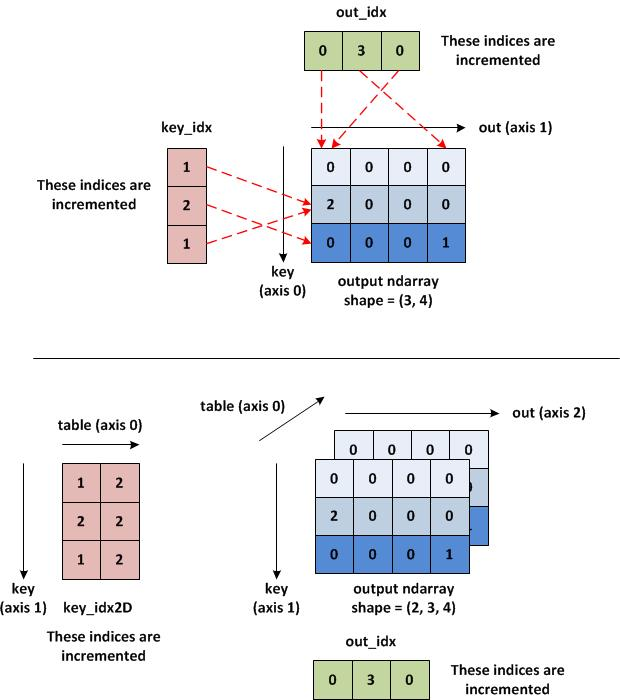

# Axis tips & tricks

In numpy, accessing an array element relies on indices. The first index or "index 0", is the first index we can potentially iterate over. When we use axis=0 with other operations such as sum(), it means we are summing the element along given axis=0 while keeping the shape constant with respect to the other axes.
It's like taking the slice of the given matrix on that dimension and performing the operation.

 In this image, we can see how axis works for 2D and 3D matrix. As axis=0 is the first index to iterate, it goes with the rows in 2D and with the depth in 3D. If we think on the line, which axis we should visit to get the element, then it becomes easier to apply axis index.

