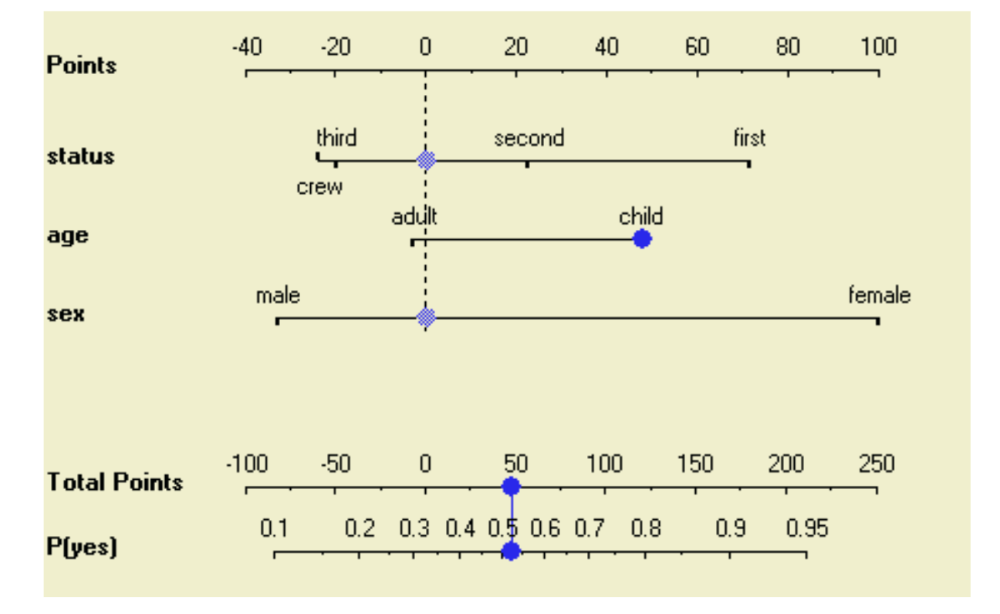

# Nomogram

## Introduction

A nomogram is a graphical representation of a numerical relationship. It was created to graphically compute outcome of an equation without having to perform any calculations. It is a useful tool to visualise the effect of different variables on the outcome of a model.
As in data science, we need to understand the model and how its variable interact with each other in graphical representation is explainable way to do so.
For Naive Bayes, features params are probability distribution which can't be represented in general visualization tools.

## How it looks

[Source](https://link.springer.com/chapter/10.1007/978-3-540-30116-5_32)

The naive Bayesian nomogram nicely reveals the structure of the model and the relative influences of the attribute values to the class probability.
Please read the paper for more details.

## Python implementation

[NomoGrapher](https://github.com/lefakkomies/pynomo/blob/master/pynomo/nomographer.py)
[Nomogram](https://github.com/Hhy096/nomogram/blob/main/nomogram.py)
